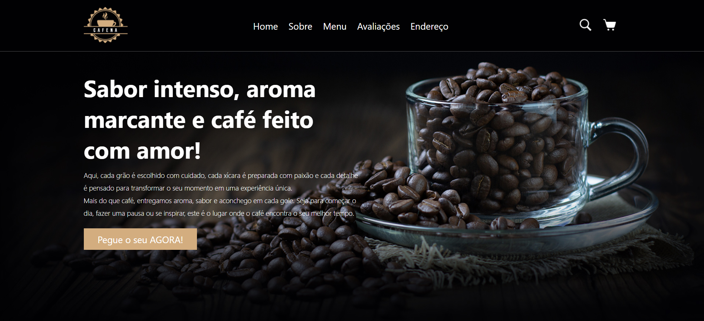

# ☕ Cafena — Site Institucional para Cafeteria

[](https://assisfilipee.github.io/Cafeteria/)

🔗 **Demo online:**  
https://assisfilipee.github.io/Cafeteria/

Projeto de site institucional desenvolvido para uma cafeteria fictícia, com foco em **experiência do usuário**, **organização visual** e **boas práticas de desenvolvimento Front-end**.  
Este projeto faz parte do meu portfólio profissional e tem como objetivo demonstrar habilidades técnicas em **HTML5** e **CSS3**, simulando um cenário real de negócio.

---

## 📌 Visão Geral

O site apresenta uma estrutura completa, incluindo:
- Página inicial com chamada comercial (CTA)
- Seção institucional “Sobre Nós”
- Cardápio com produtos
- Avaliações de clientes
- Integração com Google Maps
- Layout moderno, limpo e responsivo

Todo o conteúdo foi pensado para transmitir identidade visual, clareza de informações e fluidez na navegação.

---

## 🛠️ Tecnologias Utilizadas

- **HTML5**
  - Estrutura semântica
  - Navegação por âncoras
  - Organização por seções

- **CSS3**
  - Layout responsivo
  - Flexbox
  - Estilização de componentes (cards, botões e menus)
  - Tipografia personalizada com Google Fonts

- **Google Fonts**
  - Roboto
  - Averia Gruesa Libre

- **Google Maps Embed**
  - Exibição de localização integrada ao site

---

## 📂 Estrutura do Projeto

```bash
📁 cafena
├── 📁 img
│   ├── logo.png
│   ├── favicon.ico
│   ├── about-img.jpg
│   ├── menu-*.png
│   └── pic-*.png
├── styles.css
├── index.html
└── README.md
